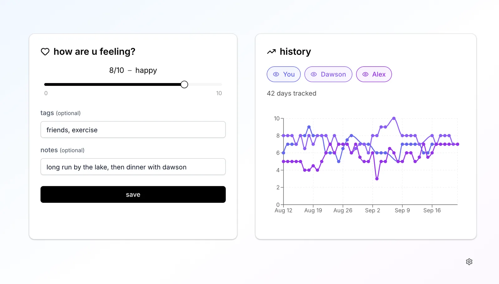
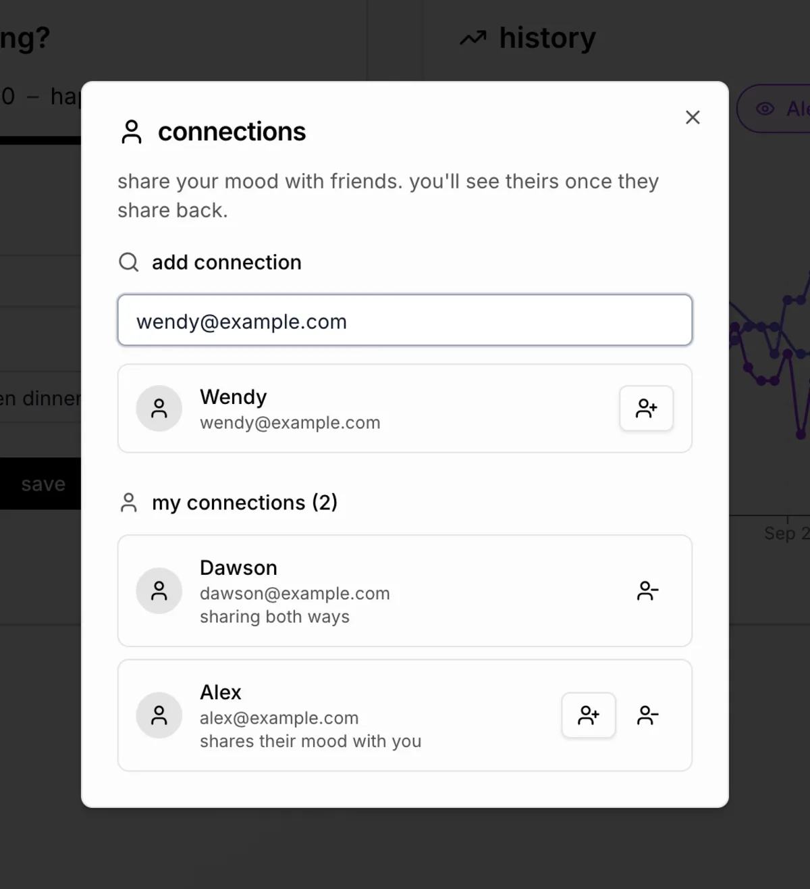
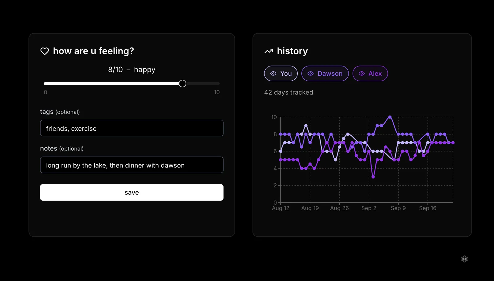
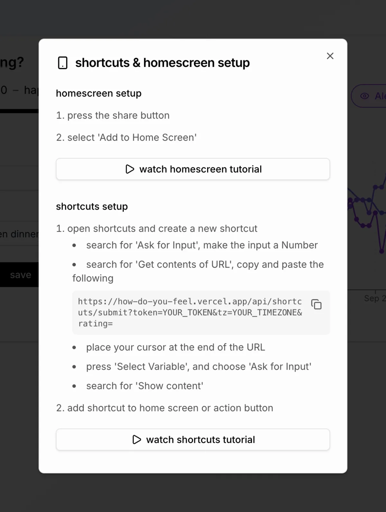

# how do you feel?

A daily mood tracker you can share with friends. If someone shares their moods with you, they show up as another line on your chart.

Live at [how-do-you-feel.vercel.app](https://how-do-you-feel.vercel.app).



## Features

- Rate your mood from 0 to 10 each day and add tags or a note
- See your history on a chart, along with anyone who shares with you
- Add friends by email and choose who can see your moods. Sharing goes one way, so you can follow someone without them following you
- Log a mood from an iOS Shortcut without opening the app
- Dark mode

## Screenshots

| Sharing moods with friends | Dark mode |
| :-: | :-: |
|  |  |

## Stack

Next.js 15, React 19, TypeScript, Prisma 6, Postgres, Auth.js, Google OAuth, Recharts, Tailwind v4, shadcn/ui. Hosted on Vercel.

## Running locally

You'll need Node 22, pnpm, a Postgres database and a Google OAuth client. Add these to `.env`:

```sh
DATABASE_URL=
GOOGLE_CLIENT_ID=
GOOGLE_CLIENT_SECRET=
NEXTAUTH_SECRET=
NEXTAUTH_URL=http://localhost:3000
```

```sh
pnpm install
pnpm prisma:migrate
pnpm dev
```

Run `pnpm seed` if you want some sample moods to look at. Other scripts: `pnpm lint`, `pnpm format`, `pnpm typecheck`, `pnpm build`.

## iOS Shortcut

Settings has a guide for adding the app to your home screen and setting up a Shortcut. It gives you an API token, and the Shortcut sends a request like this with `Authorization: Bearer <token>`:

```
POST /api/shortcuts/submit?rating=7.5&tags=work,tired&notes=long%20day
```

You can also pass `date` and `tz` to log a different day.


